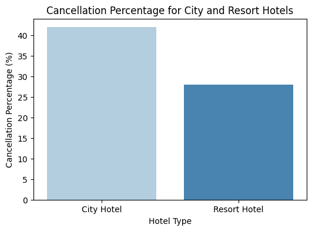
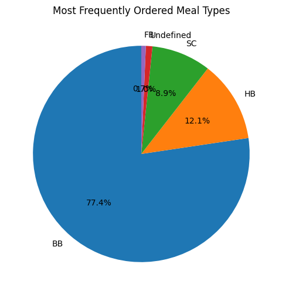
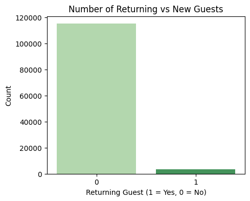
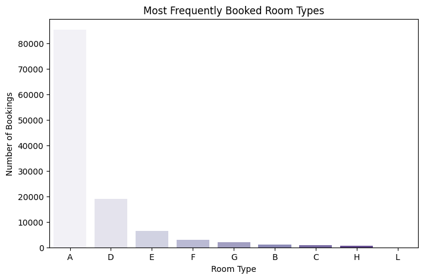
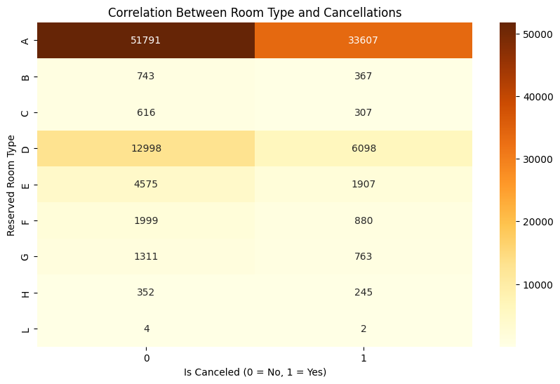
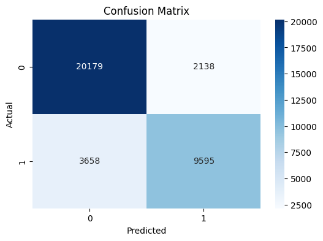
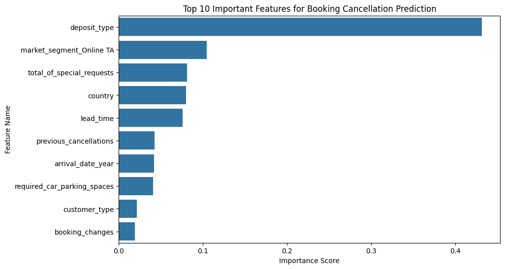

# Hotel Booking Cancellation Prediction

A machine learning project that predicts whether a hotel booking will be cancelled, using the Hotel Booking Demand dataset (119,390 bookings, 32 features). It uses a Decision Tree classifier and reaches **83.7% accuracy** on unseen test data.

This project was completed as university coursework.

## Project Overview

Hotel cancellations cost revenue and make planning harder. This project cleans and explores the booking data, looks for patterns behind cancellations, and trains a model that flags bookings likely to be cancelled.

## Tools and Libraries

- **Python**
- **Pandas** and **NumPy** for data loading, cleaning and analysis
- **Matplotlib** and **Seaborn** for visualisation
- **Scikit-learn** for encoding, scaling, training and evaluation
- **Jupyter Notebook / Google Colab**

## Workflow

### 1. Data Pre-processing
- Dropped columns that add little predictive value or would leak the answer: `company`, `agent`, `reservation_status`, `reservation_status_date`
- Filled missing values: `children` with the mean, `country` with the mode
- Removed inconsistent records:
  - bookings with no adults, children or babies (180 rows)
  - bookings with zero nights stayed (645 rows)
- Converted `arrival_date_month` from month names to numbers

### 2. Exploratory Data Analysis

**Cancellation rate: City Hotel vs Resort Hotel**
City Hotel bookings are cancelled noticeably more often than Resort Hotel bookings.



**Most popular meal types**
Bed & Breakfast (BB) is by far the most common meal plan.



**Returning vs new guests**
Only a small share of bookings come from returning guests.



**Most booked room types**
Room type A dominates bookings, followed by D and E.



**Room type vs cancellations**



### 3. Feature Engineering
- **Binning:** grouped `lead_time` into Very Short, Short, Medium, Long and Very Long
- **Label encoding:** `hotel`, `deposit_type`, `customer_type`, `country`, `assigned_room_type`
- **One-hot encoding:** `meal`, `market_segment`, `distribution_channel`, `reserved_room_type`
- **Scaling:** Min-Max scaling on `lead_time` and `adr`

### 4. Model Training
- Split the data 70% training / 30% testing, stratified on the target
- Trained a `DecisionTreeClassifier` with `max_depth=10` to limit overfitting

### 5. Results

| Metric | Not Cancelled (0) | Cancelled (1) |
|---|---|---|
| Precision | 0.85 | 0.82 |
| Recall | 0.90 | 0.72 |
| F1-score | 0.87 | 0.77 |

**Overall accuracy: 83.7%**



### 6. Feature Importance
The features that mattered most to the model's predictions:



## How to Run

1. Clone this repository:
   ```bash
   git clone https://github.com/noorbushra470-alt/hotel-booking-cancellation-prediction.git
   ```
2. Download the dataset `hotel_bookings.csv` (available on Kaggle as "Hotel booking demand") and place it in the same folder as the notebook.
3. Install the requirements:
   ```bash
   pip install numpy pandas matplotlib seaborn scikit-learn
   ```
4. Open `hotel_booking_cancellation_prediction.ipynb` in Jupyter Notebook or Google Colab and run all cells.

## Possible Improvements
- Try other models such as Random Forest or Gradient Boosting
- Tune hyperparameters with cross-validation
- Improve recall on cancelled bookings, which is currently lower (0.72)
